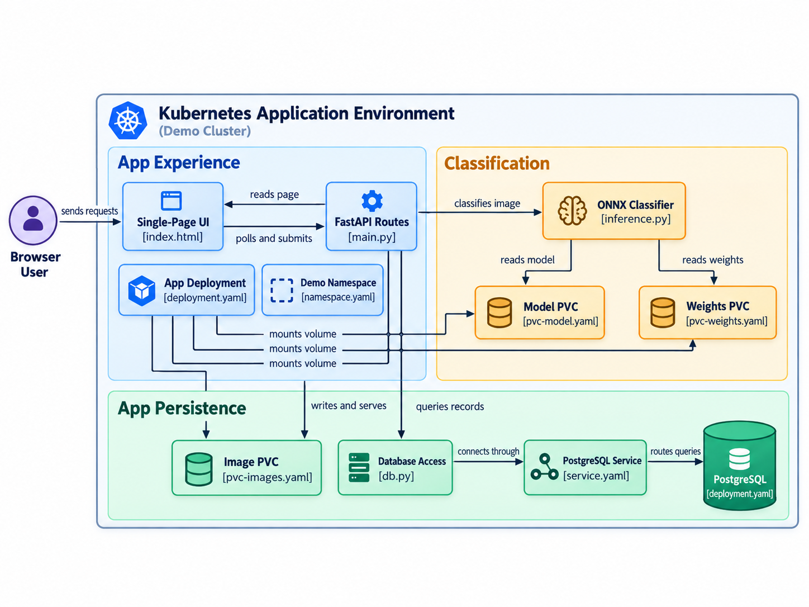

# AI Image Classifier

An image classification app: drag and drop images, get them classified by a small ONNX model
running on CPU, browse results in a live-updating grid. Deployed via a portable Helm chart.



## What it deploys

Namespace of your choice (defaults to the release name if you don't create one first):

| Component | Role | Storage |
|---|---|---|
| `classify-app` | FastAPI backend (ONNX Runtime, MobileNetV3-Small/ImageNet) + a one-page frontend | PVC, 5Gi |
| PostgreSQL | Stores classification results | PVC, 5Gi |

Two more PVCs back `classify-app`:

| PVC | Holds | Default size |
|---|---|---|
| `<release>-model` | The ONNX model graph (`model.onnx`) and its weights (`model.onnx.data`), onnxruntime needs both in the same directory | 300Mi |
| `<release>-trainingdata` | The bundled sample images (from `samples/`), classify one via `POST /samples/{filename}` | 100Mi |

An initContainer on `classify-app` seeds both from the copies baked into the image the first
time a pod starts (a no-op afterward for the model, samples are seeded with `cp -n` so new ones
added in a later image update still get picked up).

Every pod tolerates `node.kubernetes.io/not-ready` and `node.kubernetes.io/unreachable` for only
30 seconds instead of Kubernetes' 5 minute default, so a node failure gets pods rescheduled
quickly. `classify-app` and PostgreSQL both use the `Recreate` deployment strategy since their
PVCs are ReadWriteOnce, a rolling update would otherwise deadlock trying to mount the same
volume from two pods at once.

## The app

- `POST /upload`: one or more images (multipart, field name `files`). Each is saved to the
  images PVC, classified, and inserted into PostgreSQL: `sequence_id` (serial), `uuid`,
  `filename`, `label` + `confidence` (top-1), a `top3` array, `created_at` (UTC), `pod_name`
  and `node_name` (both from the Downward API).
- `GET /results`: the stored rows, most recent first.
- `DELETE /results`: deletes every image (row + file).
- `GET /image/{uuid}`: serves the stored image file.
- `DELETE /image/{uuid}`: deletes one image (row + file).
- `GET /samples`: lists the bundled sample image filenames available on the trainingdata PVC
  (not currently surfaced in the frontend, callable directly).
- `POST /samples/{filename}`: classifies one bundled sample as if it had been uploaded.
- `GET /meta`: cluster name, current pod/node, total image count, last sequence id, everything
  the frontend's banner needs.
- `GET /healthz`: liveness/readiness target.
- `GET /`: the one-page frontend (no build step, plain HTML/CSS/JS), drag-and-drop multi-file
  upload, a card grid (thumbnail, label + confidence, `#sequence_id`, short uuid, timestamp,
  pod/node, a per-card delete button), a "Delete all images" button, and a banner (cluster name,
  pod, node, total images, last sequence id). Polls `/meta` and `/results` every 3 seconds, no
  manual refresh
  needed.

The model (MobileNetV3-Small, ImageNet-1000 classes) is exported to ONNX and baked into the
image at build time, the running container never depends on torch or the internet.

## Repository layout

| Path | Purpose |
|---|---|
| `app/` | FastAPI backend source (`main.py`, `db.py`, `inference.py`) |
| `frontend/` | The single-page frontend served at `/` |
| `Dockerfile` | Multi-stage build: exports the ONNX model, then a slim onnxruntime runtime image |
| `chart/classify-app/` | The Helm chart, see below |
| `scripts/build-image.sh` | Rebuilds and pushes the image (multi-arch, `docker buildx`) |
| `samples/` | Real photos (plus a few synthetic placeholders) baked into the image and seeded onto the trainingdata PVC |
| `doc/` | Screenshots and the application diagram for this README |

The `classify-app` image is published on Docker Hub as `docker.io/cpouthier/ai-image-classify`.
`scripts/build-image.sh` is the only place image-build details live, this README doesn't
document building it, deployment is via Helm directly.

## Deploying

Requires `helm` and `kubectl` pointed at any Kubernetes cluster, nothing else is assumed, no
specific StorageClass, ingress controller, or cloud provider.

```bash
helm install classify-app chart/classify-app --create-namespace -n ai-demo
```

That's it for a quick try: it uses the cluster's default StorageClass, deploys the Service as
ClusterIP, and auto-generates a PostgreSQL password on first install (kept stable across
upgrades). Reach it with:

```bash
kubectl port-forward svc/classify-app -n ai-demo 8080:80
```

then open `http://localhost:8080`.

### Common overrides

```bash
helm install classify-app chart/classify-app -n ai-demo --create-namespace \
  --set clusterName="My Cluster" \
  --set storageClass=my-storage-class \
  --set service.type=LoadBalancer
```

Or with Ingress instead of a LoadBalancer:

```bash
helm install classify-app chart/classify-app -n ai-demo --create-namespace \
  --set ingress.enabled=true \
  --set ingress.className=nginx \
  --set ingress.host=classify.example.com
```

See `chart/classify-app/values.yaml` for the full list (image repository/tag, resource
requests/limits, PVC sizes, PostgreSQL image/credentials).

To upgrade after changing values: `helm upgrade classify-app chart/classify-app -n ai-demo ...`
(same `--set` flags as the install). To remove everything: `helm uninstall classify-app -n
ai-demo`.
